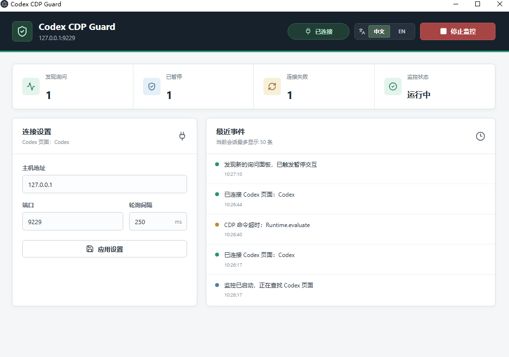
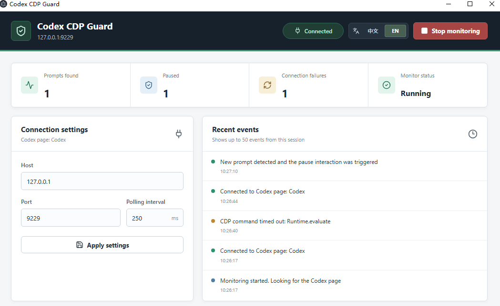

# Codex CDP Guard

<p align="center">
  <a href="#中文说明"><kbd>中文</kbd></a>
  &nbsp;
  <a href="#english"><kbd>English</kbd></a>
</p>

<p align="center">
  通过 Chrome DevTools Protocol 自动暂停 Codex 询问倒计时的 Windows 桌面工具。<br />
  A Windows desktop tool that automatically pauses Codex prompt countdowns through the Chrome DevTools Protocol.
</p>

## 界面展示 / Screenshots

### 中文



### English



---

## 中文说明

### 功能

- 自动连接开放 CDP 调试端口的 Codex 桌面端。
- 发现新的询问面板后触发暂停交互。
- 显示检测、暂停和连接失败统计，以及最近 50 条事件。
- 支持中文和英文。首次启动默认中文，可使用右上角的 `中文 / EN` 按钮切换，并记住上次选择。
- 支持修改主机、端口和轮询间隔。

### 下载

从 [GitHub Releases](https://github.com/lxnan888/codex-cdp-guard/releases) 下载 Windows x64 便携版 `.exe`，无需安装。

### 开发

```powershell
npm install
npm run dev
```

Codex 桌面端需要在 `127.0.0.1:9229` 开放页面调试端口。程序启动后会自动连接，也可以在界面修改连接设置。

### 验证

```powershell
npm run typecheck
npm test
```

### 发布

`v*` Git 标签会触发 GitHub Actions，在 Windows runner 上测试、构建便携版 EXE 并创建 GitHub Release。

程序不创建系统服务、不驻留托盘，也不保存连接配置或事件日志，仅在本地保存界面语言偏好；关闭窗口后监控立即停止。

---

## English

### Features

- Automatically connects to the Codex desktop app through its open CDP debugging port.
- Triggers the pause interaction when a new prompt panel is detected.
- Shows detection, pause, and connection-failure statistics with the 50 most recent events.
- Supports Chinese and English. Chinese is used on first launch; use the `中文 / EN` control in the top-right corner to switch languages. The last selection is remembered.
- Supports custom host, port, and polling interval settings.

### Download

Download the portable Windows x64 `.exe` from [GitHub Releases](https://github.com/lxnan888/codex-cdp-guard/releases). No installation is required.

### Development

```powershell
npm install
npm run dev
```

The Codex desktop app must expose its page debugging port at `127.0.0.1:9229`. Codex CDP Guard connects automatically on startup, and the connection settings can be changed in the interface.

### Verification

```powershell
npm run typecheck
npm test
```

### Release

Pushing a `v*` Git tag triggers GitHub Actions to test and build the portable EXE on a Windows runner and publish a GitHub Release.

The app does not install a system service, remain in the system tray, or save connection settings or event logs. Only the interface language preference is stored locally, and monitoring stops when the window closes.
